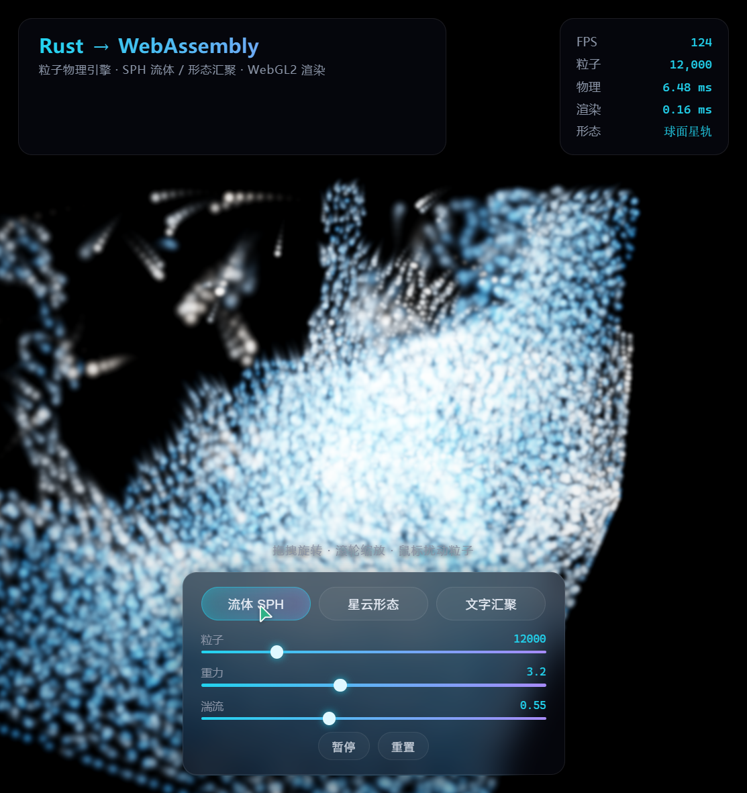
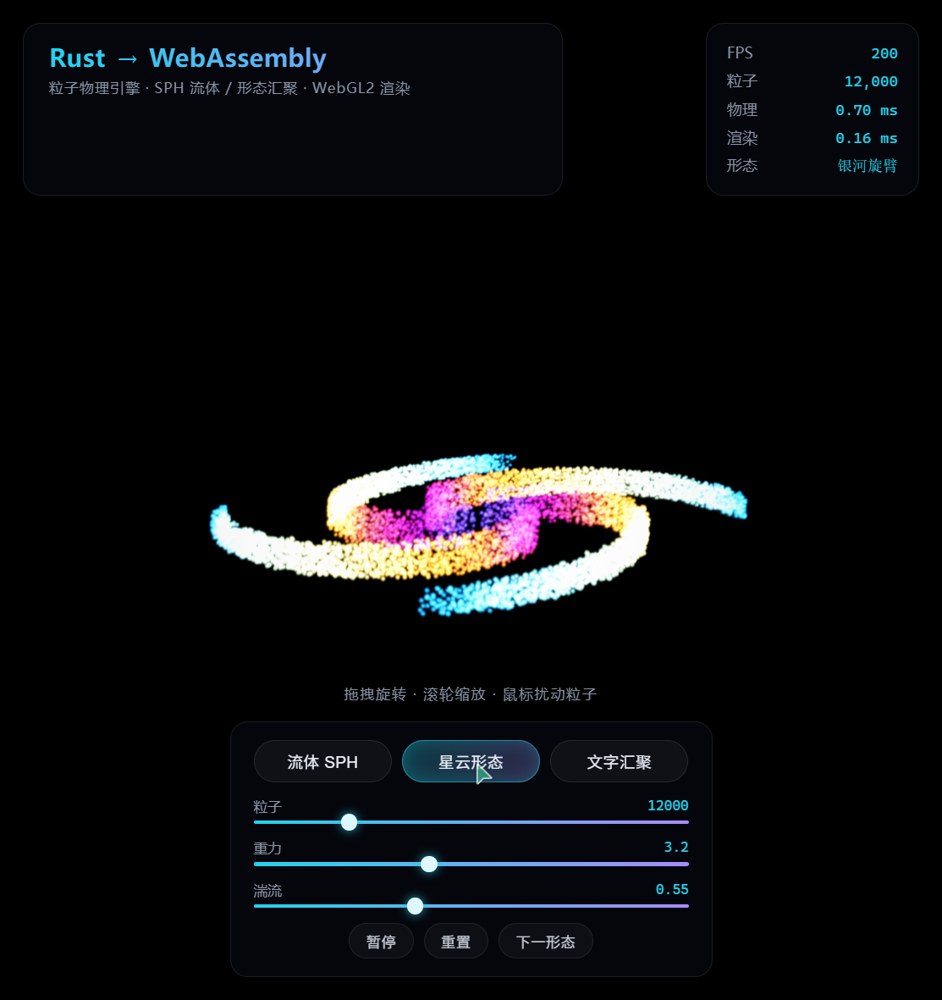
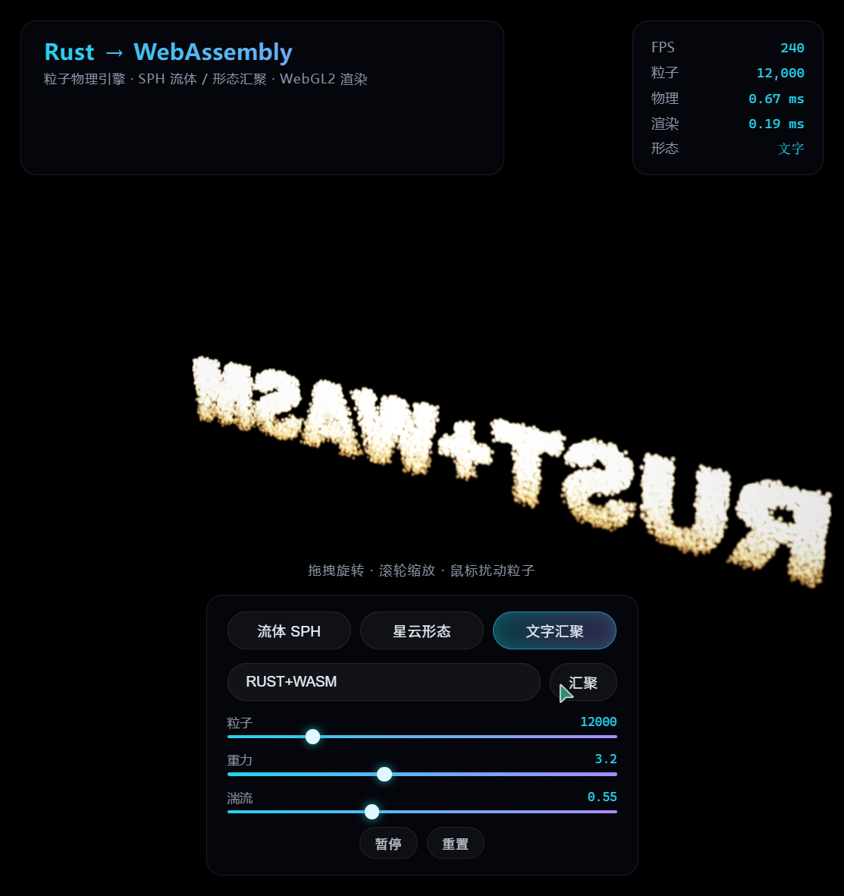

# wasm-particles

一个基于 Rust + WebAssembly 的实时粒子物理演示项目，包含 SPH 流体模拟、形态汇聚（morph）和 WebGL2 渲染。

## 实时运行效果

以下截图均为浏览器实机运行画面（12,000 粒子，单帧物理 + 渲染均在毫秒级完成）：

| 模式 | 效果 |
|:---:|:---:|
| **流体 SPH** | **星云形态** |
|  |  |
| 双重密度松弛流体，粒子碰撞飞溅、拖尾辉光 | 粒子弹性汇聚为银河旋臂等参数化形态 |
| **文字汇聚** | |
|  | |
| 任意文字光栅化为粒子目标点，金色辉光汇聚成型 | |

> 图中 HUD 为引擎实时统计：FPS、粒子数、物理耗时、渲染耗时、当前形态。

## 功能概览

- Rust 编写的粒子系统
- WebAssembly 编译到浏览器端运行
- WebGL2 2D/3D 风格渲染
- 支持交互式视角与粒子模拟
- 适合学习 wasm + graphics + physics 的小型工程

## 目录结构

- `src/`：Rust 源代码
- `web/`：前端页面和资源
- `serve.mjs`：本地静态文件服务器
- `build.ps1`：构建脚本
- `Cargo.toml`：Rust 项目配置

## 环境要求

- Rust
- wasm32 目标链
- wasm-bindgen CLI
- Node.js（用于本地静态服务）

## 安装依赖

在项目根目录执行：

```bash
rustup target add wasm32-unknown-unknown
cargo install wasm-bindgen-cli --locked
```

> 注意：`wasm-bindgen-cli` 的版本应与 `Cargo.toml` 中 `wasm-bindgen` 版本保持一致，当前版本是 `0.2.127`。

## 构建

Windows PowerShell：

```powershell
./build.ps1
```

或手动执行：

```bash
cargo build --release --target wasm32-unknown-unknown
wasm-bindgen --target web --out-dir web/pkg target/wasm32-unknown-unknown/release/wasm_particles.wasm
```

## 运行

启动本地静态服务器：

```bash
node serve.mjs
```

然后在浏览器打开：

```text
http://localhost:8090
```

## 说明

本项目的编译产物会输出到 `web/pkg/`，前端通过 `web/index.html` 和 `web/main.js` 加载生成的 WASM 代码。

## 许可证

本项目未声明许可证，默认按源码作者保留所有权利处理。
